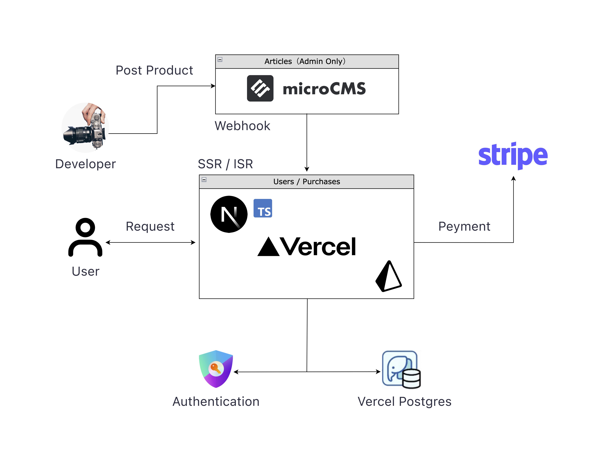

# 🧪 sandbox:/

**sandbox:/** は、Next.jsを用いて開発した電子記事販売プラットフォームです。
ユーザーは記事を検索・閲覧でき、有料記事は認証・決済を経て、購入済みのコンテンツにアクセスできます。

ユーザー認証機能（NextAuth）や決済機能（Stripe）を実装し、Webビジネスにおいて重要な2つの基盤機能を備えた構成です。
この開発を通じて、フロントエンドからバックエンド、認証、決済、デプロイまでの流れを一貫して経験し、実践的なスキルの習得を目指しました。

---

## 💻 技術スタックフロー

---

## 🛠️ 技術スタック

- **フロントエンド**：Next.js(React)、Tailwind CSSを用いたUI開発
- **バックエンド**：Next.js API RoutesによるAPI実装
- **認証機能**：NextAuth.jsによるOAuth認証（GitHub / Google）
- **データベース**：PostgreSQL + Prisma ORMによるデータ管理
- **コンテンツ管理**：MicroCMSを用いたヘッドレスCMS構築
- **決済機能**：Stripeによる決済導入
- **デプロイ**：Vercelによるデプロイ・ホスティング

---

## ⚙️ 独自機能

- ダークモード対応
- OAuth（Google）によるユーザー認証
- サイドバー（カテゴリー / アーカイブ）
- 記事のキーワード検索（ハイライト付き）
- 有料、無料記事の条件分岐表示（ログイン、購入状況に応じて表示制御）
- 独自ドメイン対応（※認証エラーのため一時ロールバック中）
- titleタグ設定

---

## 🌊 ユーザーフロー

### 1. 認証フロー
1. ユーザーが「ログイン」をクリック
2. GitHub / Google での認証
3. 認証成功後、ホーム画面にリダイレクト

### 2. 購入フロー
1. ユーザーが記事を選択
2. 「購入する」ボタンをクリック
3. 未ログインの場合はログインページへリダイレクト
4. ログイン済みの場合は Stripe チェックアウトページへリダイレクト
5. 決済成功後、購入情報がデータベースに保存され、成功ページに遷移

### 3. コンテンツアクセスフロー
1. ユーザーがプロフィールページで購入済み記事を確認
2. 購入済み書籍をクリックしてコンテンツにアクセス
3. 未購入の場合は購入フローへ誘導

---

## 📁 ディレクトリ構成（概要）

- app/
  - api/：APIルート（checkout、purchases、searchなど）
  - book/：記事詳細・購入成功ページ
  - category/：カテゴリー別記事一覧
  - profile/：ユーザープロフィール（購入履歴）
  - search/：検索ページ
  - components/：再利用可能なUIコンポーネント
  - lib/
    - microcms/：MicroCMSクライアント処理
    - next-auth/：認証設定（NextAuth.js）
    - prisma.ts：Prisma初期化
  - types/：TypeScript型定義
  - layout.tsx：アプリ共通レイアウト
- prisma/
  - schema.prisma：データベーススキーマ定義
- public/：画像・アイコンなどの静的アセット

---

## 📚 参考教材

電子記事販売WebアプリケーションをNext.jsをフル活用して実践力を身に着けるWeb開発マスター講座  
https://www.udemy.com/course/book-commerce-web-dev-with-nextjs/?couponCode=MT220725JP

教材の完成品デモ  
https://book-commerce-app-with-shincodecamp.vercel.app/

## 🌐 補足

このアプリは技術習得およびポートフォリオ用途として開発されたものです。  
ご興味ある方は、お気軽にご連絡いただくか、スター・フォーク等いただければ幸いです。